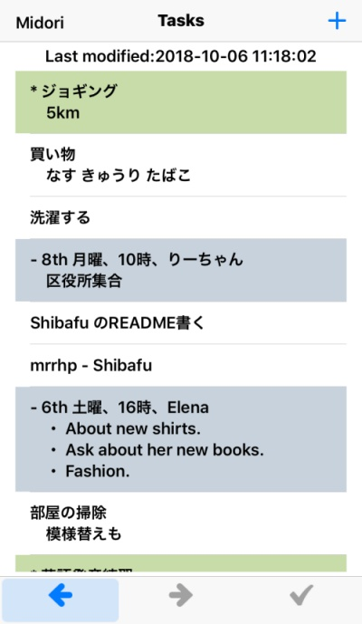
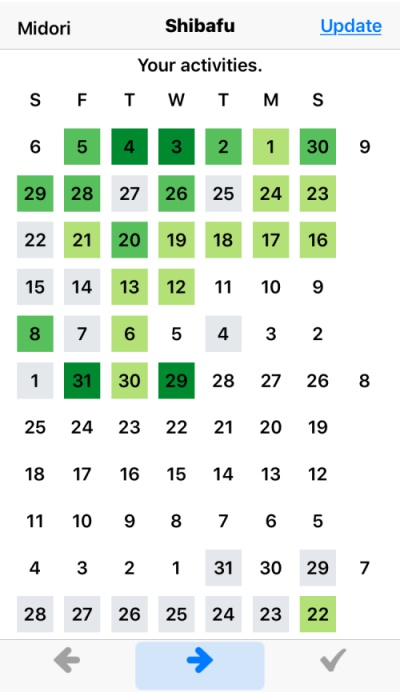

Shibafu
===

自分専用TODOアプリ。はじめてのiOSアプリ挑戦。





## Description

- ふつーのTODO機能
- タスクはプレーンテキストでDropbox上に置かれる
- ぱそこのエディタでも、アプリ上でも編集可能
- タスクをこなし模様をGitHub的芝生で閲覧

## Installation

```bash
$ git clone https://gitlab.com/midori-mate/shibafu.git
$ cd shibafu
$ sudo gem update --system -n /usr/local/bin
$ sudo gem install -n /usr/local/bin cocoapods
$ pod setup
$ pod install
```

### 'UIAlertControllerStyle' has been renamed to 'UIAlertController.Style'

そのとおり書き換える。
